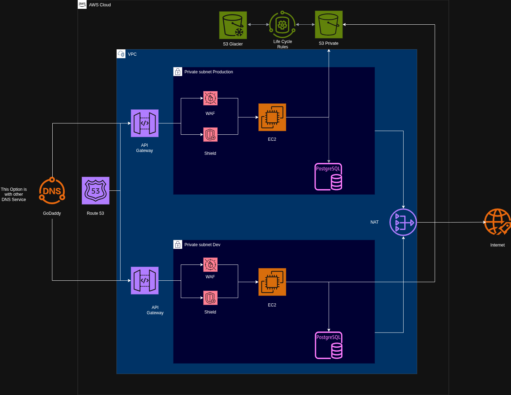
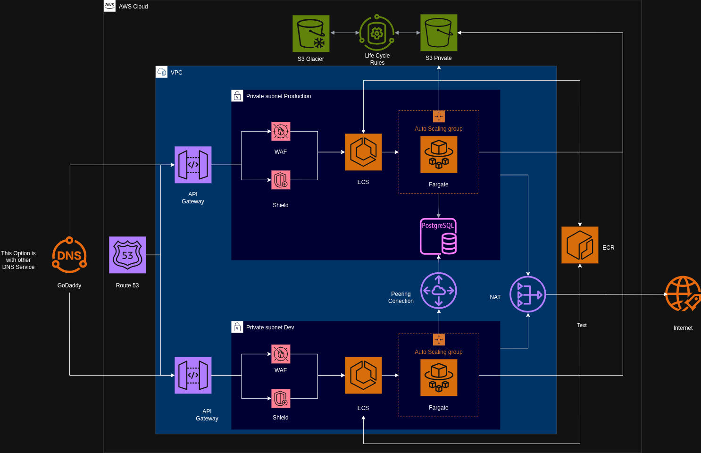
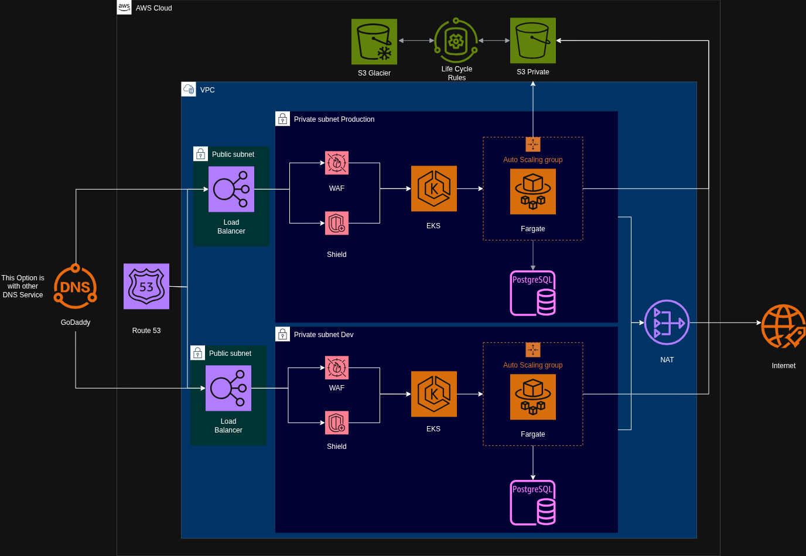
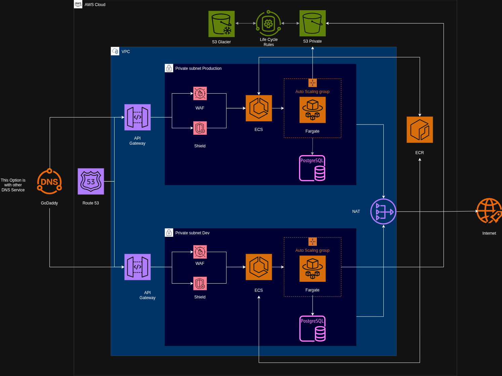

# AWS Backend Microservice Architecture

Esta solución de infraestructura como código (IaC) para cumplir el siguiente requerimeinto:

Diseña la infraestructura necesaria para desplegar un backend en AWS. 

- Expone una API REST.
- Requiere una base de datos PostgreSQL.
- Almacena archivos PDF.
- Debe estar disponible mediante HTTPS.
- Debe contar con ambientes de desarrollo y producción.

Antes de documentar la solución es importante mencionar que el requerimeinto quedo tan abierto que desarrolle algunas opciones de arqueitectura que pueden ser comentadas en la sesión con los siguientes diagramas:


### Arquitectura de solución con EC2 + RDS: 
Esto permite usar un sólo nodo estatico sin uso de fargate. En este caso la instancia EC2 puede permitir una solución simple y full stack.




### Arquitectura de solución con ECS Fargate + Pering connection + RDS: 
Esta opción permite tener alta disponibilidad con una sóla base de datos para ambos ambientes, se entiende que esto no es una buena practica o el uso de esta opción tiene una mayor viabilidad con el uso de Tenants en la base de datos directamente en el backend.




### Arquitectura de solución con Load Balancer public + EKS Fargate + RDS: 
Esta opción permite tener alta disponibilidad en caso de microservicios pero es de un costo mayor en comparación de la solución propuesta final así mismo el uso de VPC publicas genera  un riesgo de seguridad mayor



Finalmente la solución propuesta es la siguiente:

### Arquitectura de solución con ECS Fargate + RDS:
Esta arquitectura permite tener alta disponibilidad con una sólida base en escalabilidad, isolación de ambientes, seguridad y costo optimizado permitiendo usar una solución equilibrada.




## 🛠️ Servicios de AWS Seleccionados

- **API Gateway & HTTPS:** Enrutamiento de peticiones REST HTTPS gestionado para los ambientes de Dev y Prod.
- **Seguridad (WAF/Shield):** Inspección de reglas de seguridad y protección anti-DDoS en la capa de entrada.
- **Cómputo (ECS Fargate):** Orquestación de contenedores en subredes privadas sin gestión de servidores.
- **Registro (ECR):** Almacenamiento centralizado de imágenes Docker.
- **Bases de Datos (RDS PostgreSQL):** Instancias PostgreSQL aisladas por ambiente (Dev y Prod) en subredes privadas.
- **Egresos de Red (NAT Gateway):** Salida segura hacia internet desde subredes privadas.
- **Almacenamiento (S3 Private + Glacier):** Guardado de archivos PDF en S3 con archivado automático a S3 Glacier tras 90 días mediante reglas de ciclo de vida.

## 🚀 Instrucciones de Despliegue Local

1. Requisitos: `terraform >= 1.5.0` y `aws-cli` configurada.
2. Crear un archivo `terraform/terraform.tfvars`:
   ```hcl
   aws_region  = "us-east-1"
   db_password = "TuPasswordSeguro123!"
   ```
3. Ejecutar comandos de Terraform:
   ```bash
   cd terraform
   terraform init
   terraform plan
   terraform apply
   ```

## 🤖 Pipeline de CI/CD

El pipeline definido en `.github/workflows/terraform.yml`:
- **Pull Request:** Ejecuta `terraform fmt`, `validate` y `plan`.
- **Merge a `main`:** Ejecuta `terraform apply -auto-approve`.
