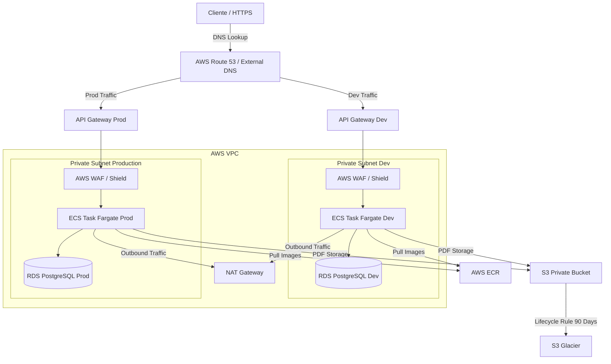

# Architecture Diagram

```mermaid
graph TD
    Client[Cliente / HTTPS] -->|DNS Lookup| R53[AWS Route 53 / External DNS]
    
    R53 -->|Dev Traffic| APIGW_Dev[API Gateway Dev]
    R53 -->|Prod Traffic| APIGW_Prod[API Gateway Prod]

    subgraph VPC [AWS VPC]
        subgraph DevEnvironment [Private Subnet Dev]
            WAF_Dev[AWS WAF / Shield] --> ECS_Dev[ECS Task Fargate Dev]
            ECS_Dev --> DB_Dev[(RDS PostgreSQL Dev)]
        end

        subgraph ProdEnvironment [Private Subnet Production]
            WAF_Prod[AWS WAF / Shield] --> ECS_Prod[ECS Task Fargate Prod]
            ECS_Prod --> DB_Prod[(RDS PostgreSQL Prod)]
        end

        NAT[NAT Gateway]
    end

    APIGW_Dev --> WAF_Dev
    APIGW_Prod --> WAF_Prod

    ECS_Dev -->|Pull Images| ECR[AWS ECR]
    ECS_Prod -->|Pull Images| ECR

    ECS_Dev -->|Outbound Traffic| NAT
    ECS_Prod -->|Outbound Traffic| NAT

    ECS_Dev -->|PDF Storage| S3[S3 Private Bucket]
    ECS_Prod -->|PDF Storage| S3

    S3 -->|Lifecycle Rule 90 Days| Glacier[S3 Glacier]
```
